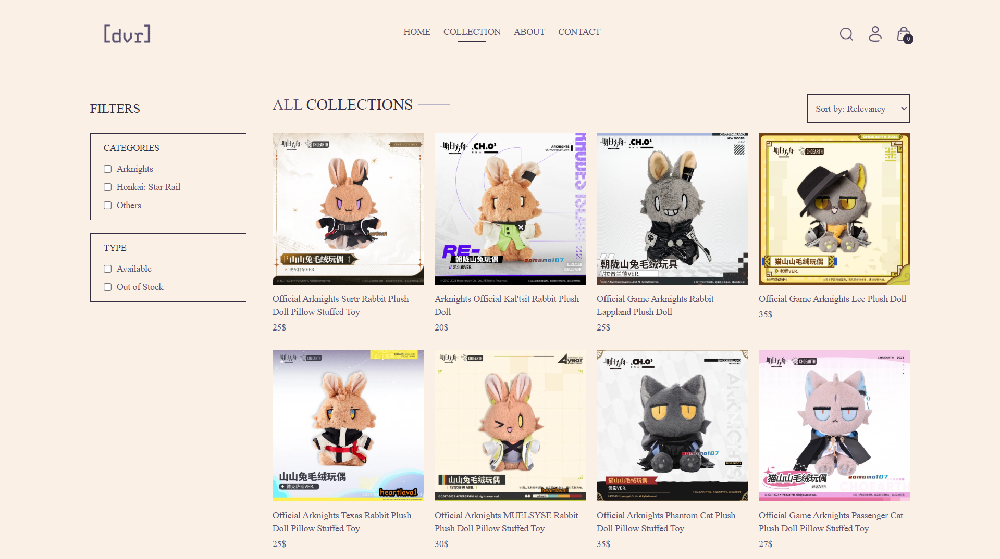
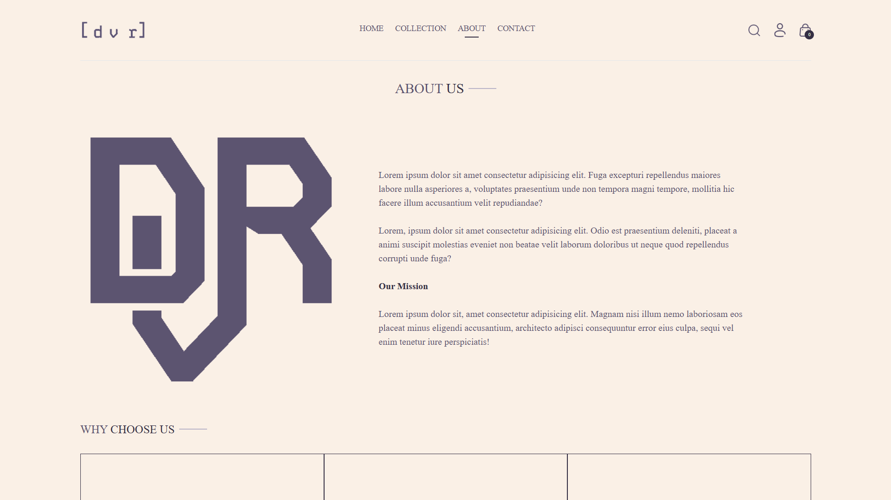
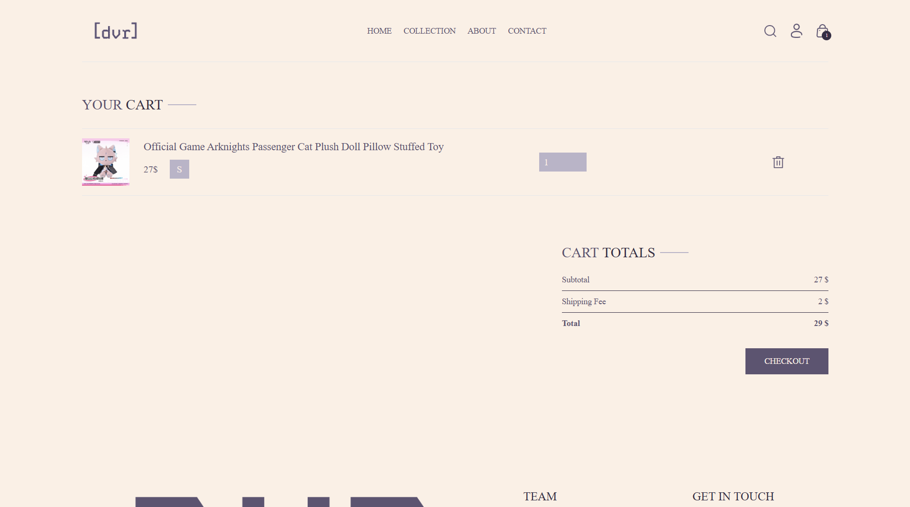
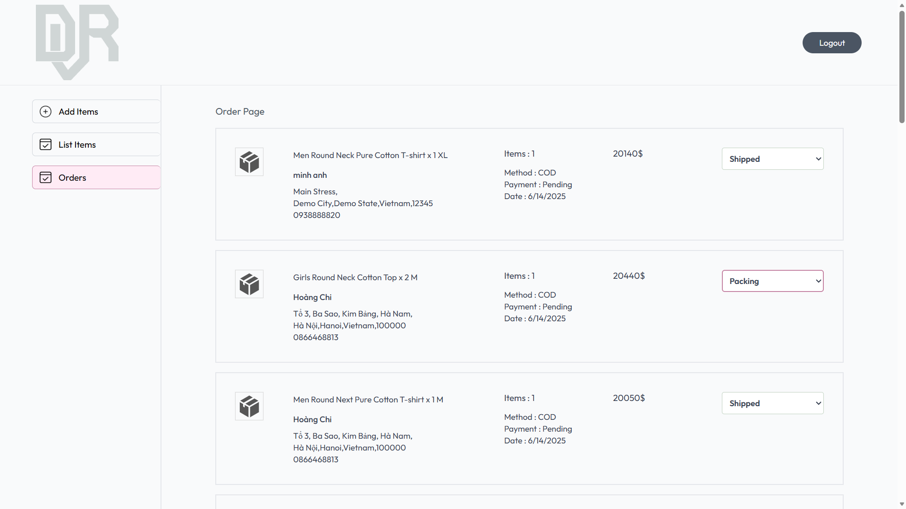

# dacs-ecommerce

## Project Description

A full-stack e-commerce web application for anime/game products, including:
- **Frontend** (React.js): Customer interface
- **Admin Panel** (React.js): Product and order management
- **Backend** (Node.js, Express.js): Business logic, RESTful API
- **Database**: MongoDB (Mongoose)

---

## Installation & Setup

### 1. Clone Repository
```bash
git clone https://github.com/whyzey81/dacs-ecommerce.git
cd dacs-ecommerce
```
### 2. Backend Setup
```bash
cd backend
npm install
npm run server
```
### 3. Frontend Setup 
```bash
cd frontend
npm run dev
```
### 4. Admin Panel Setup
```bash
cd admin
npm run dev
```
## Technologies Used
- Frontend: React.js, JavaScript ES6+, CSS3, HTML5
- Backend: Node.js, Express.js, JWT, bcrypt
- Database: MongoDB, Mongoose
- Dev tools & QA: npm, RESTful APIs, Jest, Supertest, Unit Testing
- Cloud: Cloudinary (image storage)

## Main Features
- User and admin authentication (JWT)
- Product, cart, and order management
- Product search, filter, and sorting
- Admin: CRUD products, manage orders
- Security: JWT, bcrypt, admin authentication
- Responsive UI, multi-image product upload

## Overview Use Case


## Website screenshot

| Login  |  Home
|:-:|:-:|
|  |  |

| Collection  |  About
|:-:|:-:|
|  |  |

| Product  |  Cart
|:-:|:-:|
|  |  |

| Contact  |  My Order 
|:-:|:-:|
|  |  |

| Delivery Information  |  Best Seller
|:-:|:-:|
|  |  |

| Admin Add Items  |  Admin List Items
|:-:|:-:|
|  |  |

| Update Products  |  Admin Order
|:-:|:-:|
|  |  |